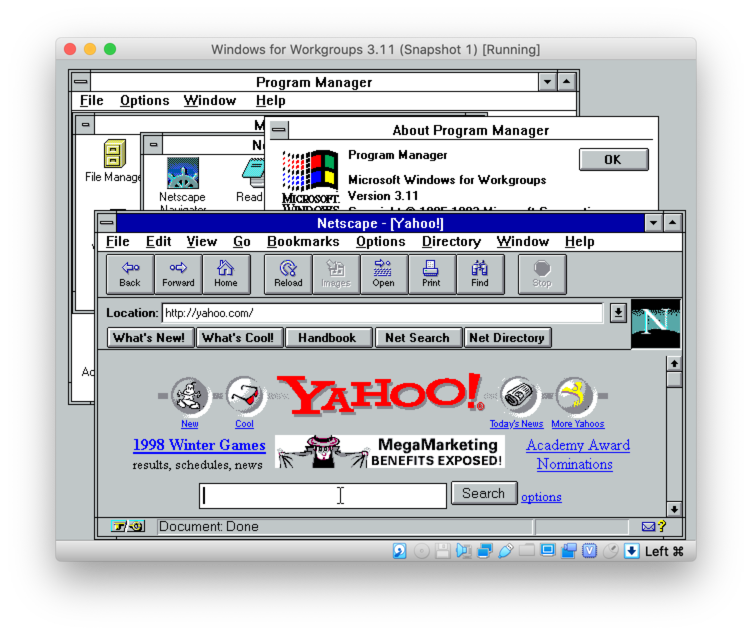

timeprox
========

Node.js HTTP proxy to the [Wayback Machine](https://web.archive.org) for retro browsers. By [remino](https://github.com/remino).

_Above: Screenshot of Netscape Navigator 2.01 on Windows for Workgroups 3.11 accessing via the timeprox HTTP proxy the front page of Yahoo! archived in 1998 by the Internet Archive's Wayback Machine. (2020-05-24)_

If you like nostalgia and love toying with retro operating systems and software from the late 90s, there's one thing missing: access the WWW, or the World Wide Web (we just call that the Web today).

Accessing the modern Web via an old browser typically doesn't work. Most sites require SSL nowadays and any implementation of HTTPS in those browsers is outdated. And in turn, trying to mimic the Web back then through a proxy doesn't work in modern browsers, since they also require more security and often force redirect to HTTPS sites.

In other words, a retro OS and a retro browser need a retro Web. This is when _timeprox_ comes in.

Simply have Node 12 or later installed, clone this repo, do `npm install` to install the requirements, then `npm start` to start. This will launch an HTTP proxy at port 3000. Set up your retro browser to use that proxy then browse the Web as you normally would.

By default, pages will be loaded from what was cached in 1998 or later, if there's anything. If nothing is found, you'll get a really boring 404 page.

The year is hardcoded, but feel free to change it and experiement. If there's anything you'd like to contribute, feel free to submit a pull request.
